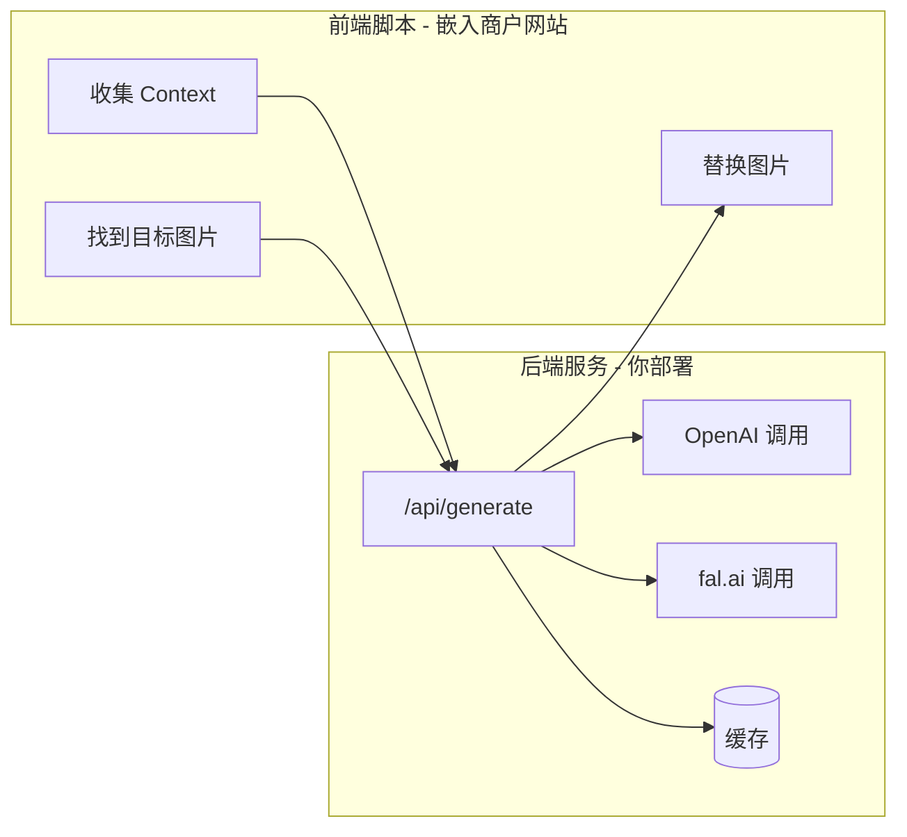
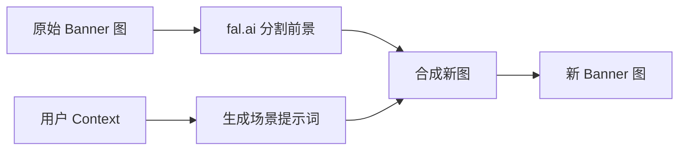
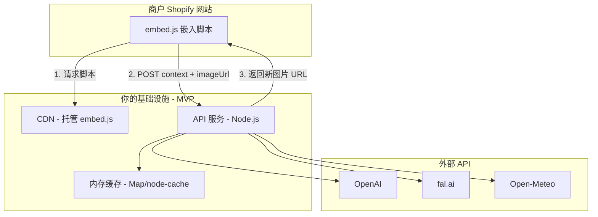

# AI 广告图生成服务 - 完整开发计划

---

## 一、只用内嵌脚本能满足需求吗？

**答案：可以满足核心需求，但有一些限制。**

### 内嵌脚本能做到的 ✅

| 功能 | 如何实现 ||------|----------|| 获取 UTM 参数 | `new URLSearchParams(location.search)` || 获取 Referrer | `document.referrer` || 获取用户时间/时区 | `new Date()`, `Intl.DateTimeFormat()` || 获取设备信息 | `navigator.userAgent`, `screen.width` || 获取地理位置 | `navigator.geolocation`（需用户授权） || 获取页面上的图片 URL | DOM 查询 || 获取产品信息 | `window.ShopifyAnalytics.meta.product` || 替换图片 | 修改 `img.src` |

### 内嵌脚本的限制 ⚠️

| 限制 | 原因 | 解决方案 ||------|------|----------|| 不能直接调用 OpenAI/fal.ai | API Key 不能暴露在前端 | 需要后端服务代理 || 跨域请求限制 | 浏览器 CORS 策略 | 后端服务设置 CORS || 无法持久化数据 | 前端只有 localStorage | 后端数据库 |

### 结论

**前端脚本 + 后端 API 服务**，缺一不可：



---

## 二、Banner 图处理方案

Banner 图（首页大图）不一定有明确的"产品 ID"，可能包含多个产品或只有场景/模特。

### 处理策略

**不需要"产品匹配"，只做：分割前景 + 根据 Context 生成背景**



| 输入 | 处理 | 输出 ||------|------|------|| Banner 原图 | fal.ai 分割出前景（产品/模特） | 前景 mask || UTM + 时间 + 天气 | OpenAI 生成氛围提示词 | "温馨冬日场景..." || 前景 + 提示词 | fal.ai 生成新背景并合成 | 最终图片 |**核心逻辑：保留原图主体，只换背景氛围**---

## 三、MVP 简化架构（不需要数据库）

MVP 阶段不需要 PostgreSQL，用内存缓存即可：



| 组件 | MVP 需要？ | 说明 ||------|-----------|------|| Node.js API | ✅ 需要 | 调用 AI 服务 || embed.js | ✅ 需要 | 前端脚本 || 内存缓存 | ✅ 需要 | 缓存生成结果 || PostgreSQL | ❌ 不需要 | 未来加持久化时再加 || Redis | ❌ 不需要 | 未来加分布式缓存时再加 |---

## 四、项目结构（MVP 简化版）

```javascript
standalone/
├── src/
│   ├── index.ts                 # 入口，HTTP 服务器 (Hono)
│   ├── routes/
│   │   ├── generate.ts          # POST /api/generate
│   │   └── health.ts            # GET /health
│   ├── services/
│   │   ├── openai.ts            # ⬅️ 复用现有代码
│   │   ├── fal.ts               # ⬅️ 复用现有代码
│   │   ├── weather.ts           # ⬅️ 复用现有代码
│   │   ├── cache.ts             # 内存缓存（简化版）
│   │   └── context.ts           # ⬅️ 复用现有代码
│   └── middleware/
│       └── cors.ts              # CORS 处理
├── public/
│   ├── embed.js                 # 前端嵌入脚本
│   └── test.html                # 本地测试页面
├── package.json
├── tsconfig.json
├── .env.example
└── README.md
```

**注意：MVP 不包含 Prisma/数据库，使用内存缓存**---

## 五、开发流程

### 阶段 1：搭建后端服务（1-2 天）

1. 创建新的 Node.js 项目（使用 Hono 或 Express）
2. 迁移现有 services 代码（openai, fal, weather, cache, context）
3. 实现 `/api/generate` 端点
4. 添加 CORS 支持
5. 本地测试

### 阶段 2：开发前端脚本（1 天）

1. 基于现有 [`ai-ads-generator.js`](extensions/theme-app-extension/assets/ai-ads-generator.js) 改造
2. 移除 Shopify 特定代码
3. 改为调用你的 API 服务
4. 添加配置项（选择器、API endpoint）

### 阶段 3：部署（0.5 天）

1. 后端部署到 Vercel / Railway / Fly.io
2. 前端脚本上传到 CDN
3. 配置域名和 HTTPS

### 阶段 4：测试（0.5 天）

1. 创建测试用的 Shopify 商店
2. 嵌入脚本测试
3. 端到端验证

---

## 六、部署方案对比

| 平台 | 优点 | 缺点 | 成本 ||------|------|------|------|| **Vercel** | 部署简单、自动 HTTPS、边缘函数 | 函数执行时间限制 10s | 免费额度充足 || **Railway** | 灵活、支持长时间运行 | 需要配置 | $5/月起 || **Fly.io** | 全球边缘部署、低延迟 | 配置稍复杂 | 免费额度 || **自建 VPS** | 完全控制 | 需要运维 | $5-20/月 |**推荐：Vercel（快速上手）或 Railway（更灵活）**---

## 六、本地开发流程

```bash
# 1. 创建项目
mkdir ai-visual-service && cd ai-visual-service
npm init -y
npm install hono @hono/node-server openai @fal-ai/client

# 2. 配置环境变量
cp .env.example .env
# 填入 OPENAI_API_KEY, FAL_KEY 等

# 3. 启动开发服务器
npm run dev
# 服务运行在 http://localhost:3000

# 4. 测试 API
curl -X POST http://localhost:3000/api/generate \
  -H "Content-Type: application/json" \
  -d '{"imageUrl": "...", "utmSource": "instagram"}'
```

---

## 八、商户接入方式

商户只需在 Shopify 主题的 `theme.liquid` 中添加：

```html
<!-- AI Visual Generator -->
<script 
  src="https://your-domain.com/embed.js"
  data-api-url="https://your-domain.com/api"
  data-hero-selector=".hero-banner img"
  data-product-image-index="1"
  defer
></script>
```

---

## 八、代码复用情况

从现有项目可直接复用的代码：| 文件 | 复用程度 | 改动 ||------|----------|------|| `app/services/fal.server.ts` | 100% | 无需改动 || `app/services/openai.server.ts` | 100% | 无需改动 || `app/services/weather.server.ts` | 100% | 无需改动 || `app/services/cache.server.ts` | 90% | 移除 Prisma 依赖或保留 || `app/services/context.server.ts` | 100% | 无需改动 || `extensions/.../ai-ads-generator.js` | 70% | 改 API 端点、移除 Shopify 特定代码 |---

## 十、下一步

确认以上方案后，我会：

1. 在当前项目中创建新的 `standalone/` 目录
2. 搭建独立的 Node.js 服务
3. 迁移并适配现有 services 代码
4. 创建可嵌入的前端脚本